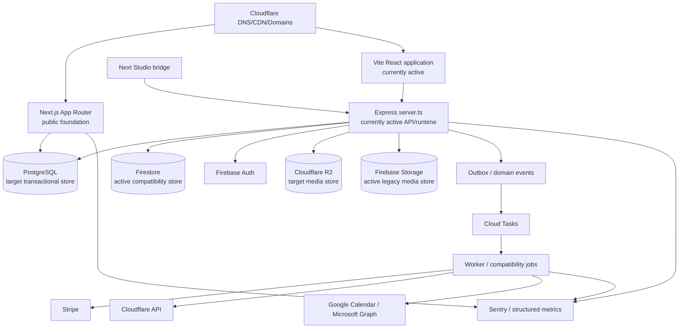
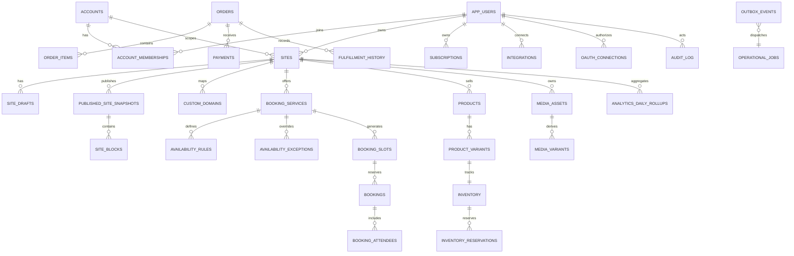
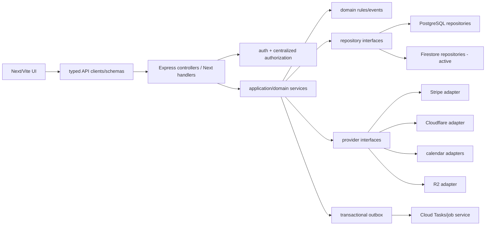

# Independent final architecture audit

Audit date: 2026-09-28  
Reviewer posture: independent principal-architect review  
Verdict: **NO-GO for production cutover**

The repository contains substantial target-architecture foundations, but it is still a strangler migration. The intended architecture cannot be confirmed as the production architecture because Firestore, Firebase Storage, Express, and Vite remain active paths.

## Executive scorecard

| Criterion | Finding | Status |
| --- | --- | --- |
| PostgreSQL authoritative application datastore | PostgreSQL repositories and 58-table schema exist, but `server.ts` still composes Firestore repositories and feature flags; authority is controlled by environment flags | **Fail** |
| Firebase Auth only | Firebase Auth is present, but Firestore and Firebase Storage are also used | **Fail** |
| R2 authoritative media | R2 adapter and PostgreSQL media metadata exist, but Firebase Storage upload/sign/delete and avatar paths remain | **Fail** |
| Next.js owns web/runtime | Next builds successfully, but Vite still builds and serves the full application and Express serves the runtime/API | **Fail** |
| Stripe isolated behind payment services | Stripe adapter/payment service exist, but adapter still delegates to legacy `server-services` implementations | **Partial** |
| Cloudflare isolated behind domain/CDN services | Cloudflare adapters/services exist, but legacy Cloudflare calls remain in the composition/compatibility layer | **Partial** |
| Async side effects through Cloud Tasks | Cloud Tasks dispatcher exists, but Firestore job storage, in-process dispatch, and compatibility gateways remain | **Partial** |
| Sentry and structured monitoring | Sentry, request IDs, job metrics, and structured logging are implemented; live/staging coverage is not proven | **Partial** |
| No legacy production paths | Firestore: 31 source files; R2 gate: 7 Firebase Storage files; Express: live API; Vite: live application | **Fail** |
| Provider-independent domain logic | Several domain modules still import Firestore types or provider-specific dependencies | **Fail** |
| Multi-tenant isolation | Central policies and negative tests pass, but some authorization/account resolution remains Firestore-backed | **Partial** |
| Transactional safety | PostgreSQL transaction services and constraints exist; concurrency tests were skipped without PostgreSQL configuration | **Partial** |
| No demo/fake production behavior | Demo fixtures are disabled in production, but template/fallback compatibility paths remain | **Partial** |
| No unbounded queries | Many PostgreSQL queries are bounded, but legacy worker/repository reads and large fixed limits remain | **Fail** |
| External integrations fully tested | Mocked provider contract tests pass; real staging provider and complete workflow evidence is absent | **Fail** |

## Final architecture diagram



The intended graph is missing the Vite, Express, Firestore, and Firebase Storage nodes. Their presence is the central audit finding.

## Target ERD assessment

The PostgreSQL target schema contains 58 tables across accounts, sites, publishing, booking, commerce, billing, integrations, media, analytics, jobs, events, and audit. The principal relationships are:



The schema is a strong foundation, but it is not yet the sole persistence authority. Legacy IDs and compatibility JSON remain in the relational model, which is appropriate during migration but not proof of completion.

## API inventory

The API contract checker reports **107 documented live routes**. Express currently declares approximately **100 route handlers**, including:

- auth, sessions, account/profile/billing/referrals;
- sites, handles, publishing, public profiles;
- audience, forms, newsletter, analytics telemetry;
- bookings and calendar synchronization;
- products, checkout, orders, fulfillment;
- media upload, completion, listing, deletion, cleanup, and public URLs;
- domains and Cloudflare provisioning;
- integrations and OAuth;
- Stripe webhooks;
- background jobs, reconciliation, outbox, and internal metrics.

Next.js currently builds these route groups:

```text
/, /[handle], /account/settings, /auth/login, /auth/register, /studio,
/api/auth/logout, /api/auth/session, /api/v1/health, /robots.txt, /sitemap.xml
```

There is no route-by-route Next equivalent for the majority of the API inventory. API documentation passing is not API implementation parity.

## Module dependency graph



The intended dependency direction exists in packages and checks, but active domain modules still depend on Firestore types and the composition root still selects legacy implementations.

## Infrastructure topology

The Cloud Run manifests define public web, Studio/API, and worker services with PostgreSQL, R2, Cloud Tasks, Secret Manager/KMS, Sentry, Stripe, Cloudflare, and calendar-provider configuration. Deployment topology checks pass. However, the manifests still include `FIRESTORE_DATABASE_ID` and `FIREBASE_STORAGE_BUCKET`, and the container still starts `server.ts`.

## Provider matrix

| Provider | Intended role | Current adapter | Current finding | Test evidence |
| --- | --- | --- | --- | --- |
| PostgreSQL | Transactions and rollups | Drizzle/`pg` repositories | Not sole authority | Infrastructure/config tests pass; concurrency skipped |
| Firebase Auth | Identity | Firebase Auth adapters/server verifier | Auth plus non-Auth Firebase services remain | Auth boundary tests pass |
| Firestore | Temporary compatibility only | Multiple repositories/workers | Active production/source dependency | Decommission gate fails with 31 files |
| Cloudflare R2 | Media objects | S3-compatible R2 adapter | Firebase Storage still active | Media tests pass; migration evidence absent |
| Firebase Storage | Temporary compatibility only | Admin/Web SDK paths | Active uploads/avatar/sign/delete | R2 decommission gate fails with 7 files |
| Stripe | Payments/billing events | Stripe adapter/payment service | Adapter delegates to legacy implementations | 10 mocked contract tests pass |
| Cloudflare | DNS/domains/CDN | Cloudflare/domain adapters | Compatibility calls remain | Domain tests pass; live outage/reconciliation unproven |
| Google Cloud Tasks | Durable jobs | Cloud Tasks dispatcher | Firestore/in-process compatibility remains | Dispatcher/job tests pass |
| Google/Microsoft | Calendar operations | Calendar provider adapters | Legacy Firestore calendar jobs remain | Mock adapter tests pass |
| Sentry | Error monitoring | Node/React/Next integrations | Configuration exists; live delivery unverified | Observability tests pass |
| Email | Transactional delivery | Resend adapter | Worker compatibility path remains | No real staging delivery evidence |

## Job and event map

The job abstraction supports email, calendar sync, OAuth refresh, domain verification, analytics rollups, media processing, Stripe reconciliation, order processing, and cleanup. Job IDs, idempotency keys, retries, leases, dead letters, and correlation IDs are implemented.

Domain event catalog includes site publication, booking creation/cancellation, order creation/payment/fulfillment, subscription changes, domain verification, media upload, and integration disconnect events.

The concern is authority and delivery storage: Firestore job/outbox repositories and compatibility HTTP/Pub/Sub paths remain alongside Cloud Tasks/PostgreSQL.

## Security matrix

| Control | Evidence | Assessment |
| --- | --- | --- |
| Firebase token verification | Server auth verifier and Next server auth | Implemented; live outage behavior needs staging test |
| Default-deny resource authorization | Central policy/service | Implemented; policy data source still partly Firestore-backed |
| Tenant/site ownership | Authorization context, repository scoping, negative tests | Partial; database/RLS-style defense is not universal |
| SQL injection | Parameterized PostgreSQL queries | Positive evidence; static review still required for all dynamic clauses |
| Webhook validation | Stripe adapter/signature and ledger | Implemented; real replay test absent |
| OAuth state/token encryption | OAuth service and KMS envelope | Implemented; rotation/reconnect staging test absent |
| Upload security | MIME/size/dimensions/quota/media ownership tests | Partial because Firebase Storage path remains |
| CSRF/CORS/headers | Express middleware and Next headers | Implemented in tested paths; dual runtimes increase drift risk |
| Secrets | Secret Manager/KMS integration and scans | Implemented; provider rotation not exercised end-to-end |
| IDOR/cross-tenant access | Authorization resource tests | Passing focused tests |

## Test report

Passing evidence:

- TypeScript check, Vite build, and Next production build.
- Architecture boundaries, provider boundary, route persistence, deployment topology, ADR checks.
- Unit, domain, HTTP integration, provider contract, security, tenant, authorization, media, observability, outbox, entitlement, and migration tests.
- Local PostgreSQL restore drill: 58 tables and 16 migrations restored and cleaned up.

Important failures/limitations:

- The consolidated legacy suite reported five failures around sitemap/profile/custom-domain/SSL behavior and one existing-handle assertion; its runner did not propagate a reliable nonzero exit code.
- Booking and commerce concurrency tests were skipped because PostgreSQL was not configured for those test processes.
- Mock provider contracts passed, but real Stripe, Cloudflare, R2, Firebase Auth, Google Calendar, Microsoft Graph, email, and Cloud Tasks staging flows were not evidenced in this audit.
- The Vite build still succeeds and emits the active production client bundle.
- The Next build proves compilation, not functional equivalence.

## Operational runbook

The recovery procedures are documented in [the operational recovery runbook](operations/recovery-runbook.md), including PostgreSQL backups/PITR, R2 recovery, Auth outage handling, Stripe replay, Cloud Tasks recovery, secret rotation, domain outages, rollback, and RPO/RTO targets.

## Remaining technical debt

1. Complete Firestore reconciliation and remove all non-Auth Firestore paths.
2. Complete R2 media reconciliation and remove Firebase Storage code/rules/config.
3. Migrate all 107 documented API behaviors to Next handlers or record approved removals.
4. Move the full Studio and landing/template surface from Vite to Next.
5. Make PostgreSQL account/authorization/feature-flag state authoritative.
6. Remove legacy provider delegation from Stripe and Cloudflare adapters.
7. Make Cloud Tasks/PostgreSQL the only job/outbox path.
8. Replace unbounded/large fixed-limit Firestore worker reads with cursor/batch processing.
9. Run enabled PostgreSQL concurrency tests against isolated test databases.
10. Repair the five legacy SEO/custom-domain test failures and make the test runner fail reliably.
11. Add real staging contract tests and provider replay/recovery drills.
12. Remove compatibility IDs, migration flags, and fallback readers only after observation windows pass.

## Final production-readiness verdict

**NO-GO.** The platform is not yet the requested final architecture. It is a well-instrumented migration foundation with passing structural checks, but the authoritative datastore, runtime, media provider, and async platform have not fully replaced the legacy paths. Production cutover should wait until the three existing decommission gates pass, all critical workflow tests run against PostgreSQL, the legacy failures are resolved, and real staging provider tests demonstrate equivalence.

