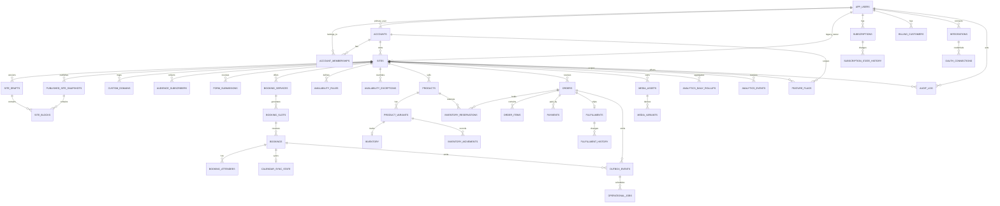

# Production PostgreSQL schema design

**Status:** designed and represented by SQL migrations 001–005.  
**Schema authority:** checked-in SQL under [`db/migrations`](../db/migrations).  
**Typed access model:** [`server/infrastructure/postgres/schema.ts`](../server/infrastructure/postgres/schema.ts).  
**Traffic:** PostgreSQL is the target authoritative datastore for transactional domains; current application traffic remains on Firestore until bounded cutovers complete.

## Design rules

- Every tenant-owned aggregate carries `account_id`; every site-owned aggregate carries both `account_id` and `site_id`.
- Composite foreign keys such as `(site_id, account_id)` prevent a row from pointing at a site in another account.
- Provider identifiers are stored alongside internal identifiers and are unique within provider scope.
- State transitions are guarded in application services and, where invariant-critical, by PostgreSQL triggers/constraints.
- JSONB is used for versioned site/design/block configuration, provider payloads, audit metadata, and analytics dimensions. It is not used to hide queryable relational fields.
- Idempotency keys are scoped to the aggregate/tenant operation, not globally unless the provider event itself is globally unique.
- Audit, published snapshots, inventory movements, and webhook ledgers are append-only from the application perspective.
- Soft deletion is limited to audience consent records and media lifecycle metadata; transactional records are retained with terminal states.

## ERD

## Table inventory

| Area | Tables | Ownership and key invariants |
|---|---|---|
| Identity/tenancy | `app_users`, `accounts`, `account_memberships` | Firebase UID is retained as `app_users.external_auth_id`; membership role is constrained; account is the tenant boundary |
| Sites/content | `sites`, `site_drafts`, `published_site_snapshots`, `site_blocks` | handle unique; drafts versioned; current published snapshot unique per site; snapshots immutable; block belongs to exactly one draft or snapshot |
| Domains | `custom_domains` | hostname and site unique; verification, SSL, provisioning state, DNS/routing JSONB; provisioning idempotency key |
| Audience/forms | `audience_subscribers`, `form_submissions` | normalized email uniqueness per site; consent status; form idempotency per site; retention deadline |
| Booking | `booking_services`, `availability_rules`, `availability_exceptions`, `booking_slots`, `bookings`, `booking_attendees`, `calendar_sync_state`, `booking_idempotency_keys` | slot uniqueness, exclusion constraint for active overlap, capacity checks, transaction-held reservations |
| Commerce | `products`, `product_variants`, `inventory`, `inventory_reservations`, `inventory_movements` | SKU/product uniqueness, nonnegative inventory, reservation expiry, append-only movements and idempotency |
| Orders/payments | `orders`, `order_items`, `payments`, `fulfillments`, `fulfillment_history` | order state trigger, item totals, provider event/idempotency uniqueness, fulfillment history append-only |
| Billing | `billing_price_mappings`, `billing_customers`, `subscriptions`, `subscription_state_history`, `billing_webhook_events`, `billing_reconciliation_runs` | internal subscription state is authoritative; Stripe identifiers unique; webhook delivery deduplicated |
| Integrations | `integrations`, `oauth_connections` | encrypted tokens only; scoped ownership; refresh lock; key version; least-privilege scopes; reconnect/revocation state |
| Media | `media_assets`, `media_variants` | metadata owns lifecycle; object keys unique; original/processed/thumbnail variants; abandoned upload cleanup |
| Analytics | `analytics_events`, `analytics_daily_rollups`, `analytics_visitor_days` | short-lived ingestion buffer/rollups in PostgreSQL; high-volume raw history belongs in BigQuery/equivalent |
| Async/eventing | `outbox_events`, `operational_jobs`, `idempotency_keys`, `webhook_events` | stable idempotency, leases, bounded attempts, retry/dead-letter state |
| Governance | `audit_log`, `feature_flags` | audit append-only; flags scoped to account/site with rollout/expiry |

## Important indexes

| Workload | Indexes/constraints |
|---|---|
| Tenant/site reads | `sites_account_updated_idx`, composite `(site_id, account_id)` FKs, account/site indexes on new aggregates |
| Public publishing | unique `sites.handle`, partial current snapshot index, `(site_id, created_at DESC)` snapshot index |
| Booking availability | `(site_id, service_id, starts_at)`, active-slot partial unique index, `EXCLUDE USING gist` on active booking time ranges |
| Inventory | variant primary key, open-reservation partial index, reservation expiry index, movement `(variant_id, created_at)` |
| Orders | creator/time, site/status/time, state/time, order idempotency per site |
| Payments/webhooks | provider/payment ID, provider/event ID, provider/idempotency key, retry partial indexes |
| OAuth | account/provider/site unique, refresh due index, idempotent connect key |
| Media | owner/site/time, processing-state partial index, object key unique |
| Analytics | site/time, owner/time, retention index, rollup `(site_id, day)` primary key |
| Jobs/outbox | `(status, available_at, created_at)` claim indexes and scoped idempotency unique indexes |
| Audit | entity/time, site/time, actor/time, action/time |

Do not add indexes speculatively. Every new index must correspond to a repository query, a constraint, or a worker claim path and include an expected cardinality/retention review.

## Transaction boundaries

| Transaction | Must be atomic | External calls |
|---|---|---|
| Site publish | validate draft, create immutable snapshot, mark current snapshot, append `SitePublished` outbox event, audit | CDN/cache invalidation is after commit |
| Booking reservation | lock slot, verify capacity/overlap, create booking/attendees/idempotency record, append event | calendar/email jobs are after commit |
| Booking cancellation | lock booking, transition state, release slot, append event/audit | calendar cancellation after commit |
| Inventory reservation | lock inventory row, expire stale reservations, reserve quantity, append movement, link order | no Stripe/provider call inside transaction |
| Order creation | create order/items, persist idempotency key, reserve inventory, append `OrderCreated` | payment session creation after commit or through an explicit compensating state |
| Payment reconciliation | claim provider event idempotently, update payment/order state, append state history/outbox | Stripe API call outside transaction |
| Subscription update | claim webhook, update subscription/billing state/history, recompute entitlement snapshot, append event | provider fetch/reconciliation outside transaction |
| OAuth connect/refresh | lock connection, rotate encrypted token/key version, update state | OAuth provider token exchange outside transaction; persist result in a short transaction |
| Domain provisioning | update local provisioning state and idempotency record | Cloudflare/DNS/SSL operations outside transaction |
| Analytics rollup | dedupe event, update bounded rollup, mark ingestion/rollup checkpoint | BigQuery publish outside the OLTP transaction |
| Job/outbox claim | lease one row using `FOR UPDATE SKIP LOCKED`, increment attempt, persist status | handler/provider execution outside transaction |

Distributed transactions across Stripe, Cloudflare, calendars, email, storage, or BigQuery are explicitly avoided. The outbox and idempotent workers provide the consistency boundary.

## Constraints and soft deletion

- Foreign keys use `ON DELETE CASCADE` only for owned dependents such as site blocks, media variants, and membership rows. Financial, booking, and audit history use `RESTRICT` or terminal states.
- Active booking overlap is database-enforced with a GiST exclusion constraint; application checks are advisory and improve error messages only.
- Inventory movement rows cannot be updated or deleted by a trigger.
- Published snapshots cannot be updated or deleted by a trigger.
- `audience_subscribers.deleted_at` preserves consent/unsubscribe history while excluding a subscriber from active uniqueness and creator lists.
- `media_assets.deleted_at` preserves ownership/audit metadata while workers remove provider objects asynchronously.
- Orders, payments, subscriptions, bookings, fulfillment history, webhooks, jobs, outbox events, and audit logs do not use soft delete. They transition to terminal states and are retained according to policy.

## Migration plan

1. **001–004 foundation:** create target transactional schema, harden constraints, and retain legacy Firestore identity/payload columns for reconciliation.
2. **005 content/operations completion:** add site drafts/snapshots/blocks, audience/forms, fulfillment history, OAuth credentials, general webhook ledger, and feature flags. Apply to local/test first, then staging.
3. **Backfill references:** create `app_users`, `accounts`, memberships, and site account mappings; reject rows that cannot be assigned to a tenant.
4. **Backfill bounded domains:** sites/content → bookings → products/inventory → orders/payments → subscriptions/integrations. Each domain gets checkpoints, reconciliation, shadow reads, and a kill switch.
5. **Dual-write only after repository contract tests:** write PostgreSQL and legacy Firestore atomically from the application’s perspective using retryable outbox/reconciliation; never pretend cross-database writes are one transaction.
6. **Shadow-read comparison:** compare normalized API projections, not storage-specific document shapes. Block cutover on mismatch.
7. **Feature-flagged authority:** switch reads per tenant/site, monitor error/latency/reconciliation metrics, retain Firestore rollback reads until the evidence window closes.
8. **Constraint tightening:** after all legacy rows are mapped, make `sites.account_id` non-null, remove legacy payload columns only in a later expand/contract migration, and retire old repositories last.

Every migration is additive/backward-compatible first, checksum-locked, applied under advisory lock, verified in staging, and monitored before promotion.

## Data retention

| Data | Retention guidance |
|---|---|
| Accounts/sites/content | retain while account exists; deletion is an account workflow with export and grace period |
| Published snapshots | retain active history for rollback; compact only after a documented product retention policy |
| Audience/forms | retain consent/unsubscribe evidence; purge payloads after the declared form retention deadline |
| Bookings/orders/payments/subscriptions | retain according to applicable tax, accounting, contractual, and dispute requirements; use terminal states |
| Inventory movements/fulfillment history | append-only; retain for reconciliation and fulfillment disputes |
| OAuth tokens | revoke and cryptographically destroy token material on disconnect; retain non-secret connection audit metadata |
| Media | delete abandoned uploads after TTL; retain metadata tombstones through the audit period |
| Raw analytics | short OLTP TTL; move durable history to BigQuery/equivalent with partition expiration |
| Webhooks/jobs/outbox | retain processed records long enough for replay/reconciliation; archive or purge after operational replay window |
| Audit logs | immutable, access-controlled, retained according to compliance/admin policy |
| Feature flags | expire temporary flags automatically; retain change/audit history outside the hot flag table if required |

## Verification checklist

- Apply migrations to an empty PostgreSQL 16 database.
- Apply them a second time and verify checksum/idempotent behavior.
- Run constraint-violation tests for tenant mismatch, duplicate handles, booking overlap, duplicate provider events, inventory underflow, and duplicate idempotency keys.
- Run concurrency tests for booking and inventory reservation.
- Verify `schema_migrations` and health/readiness before any repository cutover.
- Confirm no route or worker selects PostgreSQL until the corresponding bounded-context migration flag is enabled.

